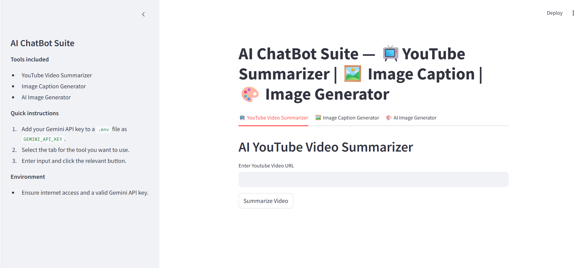
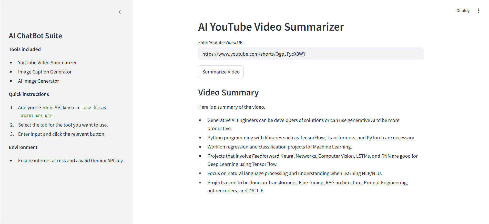
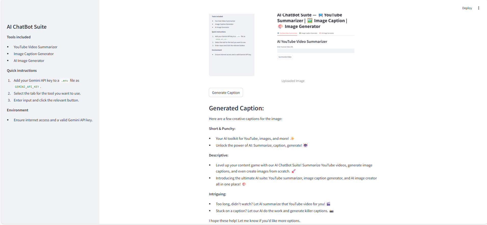
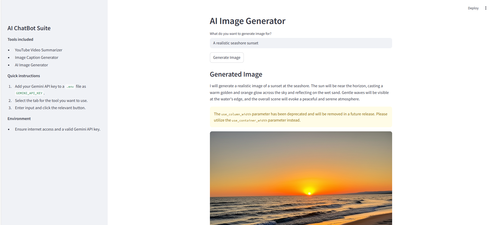

# 🤖 AI Multimodal Suite  



> A multi-tool **Streamlit app** powered by **Google Gemini API**.  
> Includes **YouTube Summarizer**, **Image Caption Generator**, and **AI Image Generator** — all in one sleek interface with tabs.  

---

## ✨ Features

### 📺 YouTube Video Summarizer
Paste a YouTube URL → Get a **concise bullet-point summary** of the video.  


---

### 🖼️ Image Caption Generator
Upload an image → Generate a **creative AI caption**.  


---

### 🎨 AI Image Generator
Enter a prompt → Generate **AI-powered images** + optional descriptions.  


---

## 🛠️ Tech Stack
- [Streamlit](https://streamlit.io/) — UI framework  
- [Google Gemini API](https://ai.google.dev/) — AI backbone  
- [LangChain](https://www.langchain.com/) — integrations  
- [PIL](https://pillow.readthedocs.io/) — image handling  
- `.env` for secure API key storage  

---

## 📂 Project Structure
├── Combined_AI_Suite.py # Unified Streamlit app (with tabs & sidebar)
├── requirements.txt # Dependencies
├── .env # API keys (not shared publicly!)
├── AI_Multimodal_Suite.png # Main screenshot
├── AI_Multimodal_Suite_Youtube_Summarizer.png
├── AI_Multimodal_Suite_Image_Caption.png
├── AI_Multimodal_Suite_Image_Generator.png


---

## ⚡ Quick Start

1️⃣ **Clone the repo**
```bash
git clone https://github.com/pathareprashant5/ai-multimodal-suite.git
cd ai-Multimodal-suite

2️⃣ Set up environment
python -m venv .venv
source .venv/bin/activate    # Linux/Mac
.venv\Scripts\activate       # Windows

3️⃣ Install dependencies
pip install -r requirements.txt

4️⃣ Add your API keys in .env (Google Gemini required):
GEMINI_API_KEY=your_api_key_here

5️⃣ Run the app
streamlit run Combined_AI_Suite.py

🚀 Future Enhancements:
🌐 Multi-language support (summaries & captions)
📊 Export results (PDF/Markdown)
☁️ Cloud deployment (Streamlit Cloud / Docker)
